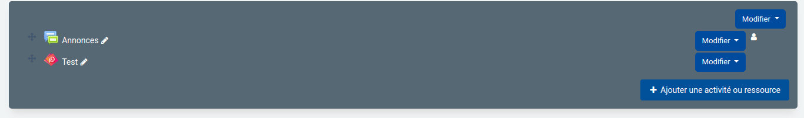
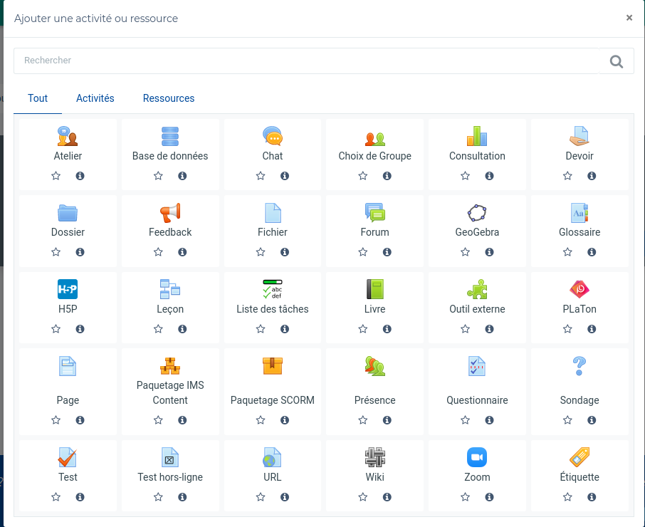
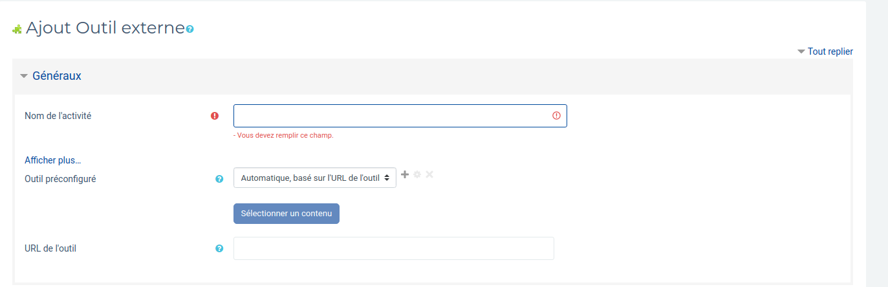

# Tutoriel d'ajout d'une activité Premier Langage (PL) via Moodle avec LTI

Ce tutoriel a pour objectif de vous initier dans la création d'une activité Platon depuis Moodle grâce au protocole LTI.

## Prérequis

- Avoir créer une activité PL
- Avoir créer un cours sur Moodle
- Avoir la possibilité de créer des cours et avoir accès au mode édition sur Moodle

## 1 - Ajout d'une activité
Dans votre cours Moodle, passer en mode édition et cliquer sur l'onget "Ajouter une nouvelle activité".

## 2 - Choix de l'outil
Un onglet de choix s'ouvrira, cliquer sur "Outil externe".

## 3 - Liaison Moodle / PL
Des informations vous seront ensuite demandé.
Vous devez remplir les champs suivant:
- Nom de l'activité
- Outil préconfiguré : à mettre sur "Automatique, basé sur l'URL de l'outil"
- URL de l'outil : l'URL de votre activité PL
- Clé : Moodle
- Secret : secret

